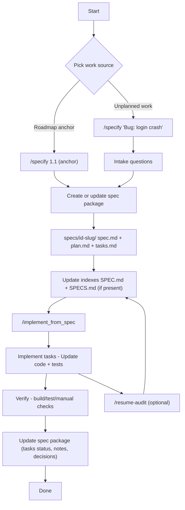

# Archived SDD Template Documentation

This file contains the original `README.md` content from the SDD (Spec Driven Development) starter template used to initialize this project. It is preserved here for reference regarding the workflow, rules, and commands.

---

# Antigravity SDD Starter

Spec Driven Development starter for Antigravity: 1 rule, 3 workflows, plus Unplanned Intake.

This setup gives you a lightweight, repeatable SDD workflow that stays aligned with your PRD and roadmap while still handling bugs and unplanned work cleanly.

## What you get

- **One workspace rule**
  - `.agent/rules/10-sdd.md`
- **Three workflows**
  - `.agent/workflows/specify.md`
  - `.agent/workflows/implement_from_spec.md`
  - `.agent/workflows/resume-audit.md`
- **One entrypoint**
  - `SPEC.md` (repo root, tells the agent what spec to implement right now)

## Quick Start (new contributors)

1. Pick a roadmap anchor (example: `1.1`) from `docs/roadmap.md`.
2. Generate or update the spec package:
   - `/specify 1.1`
3. Implement the spec:
   - `/implement_from_spec`
4. If you stop for a while or come back later, run:
   - `/resume-audit`

## Install

Copy these files into your repo. This has been tested in **Workspace** rules only (not Global).

### Copy as-is (no edits required)

- `.agent/rules/10-sdd.md`
- `.agent/workflows/specify.md`
- `.agent/workflows/implement_from_spec.md`
- `.agent/workflows/resume-audit.md`
- `SPEC.md` (repo root)

### Create these project files (project-specific)

Note: prompt templates (PRD/constitution/roadmap/SPECS) are shipped in the starter zip for convenience.
They are not required to be present in the repo.

- `docs/PRD.md`
- `constitution.md`
  - Optional location if your tooling expects it: `.specify/memory/constitution.md`
- `docs/roadmap.md`
- `SPECS.md` (repo root, multi-epic index)

## Create the project docs

These docs are the backbone of the workflow. Prompt templates are optional helpers included in the starter zip.
You do not need to keep a `prompts/` folder in your repo unless you want the templates checked in.

1. **`docs/PRD.md` (Product Requirements Document)**
   
   - The source-of-truth for product goals, scope, and constraints.
   - Prompt template (included in the starter zip, not required in-repo):
     - `prompts/PRD-prompt.md`

2. **`constitution.md` (Development constitution)**
   
   - Establishes principles, quality bars, and workflow gates.
   - Use your `docs/PRD.md` as input when generating this.
   - Prompt template (included in the starter zip, not required in-repo):
     - `prompts/constitution-prompt.md`

3. **`docs/roadmap.md`**
   
   - Breaks the PRD into epics (often grouped by breakpoints, milestones, or releases).
   - Use `docs/PRD.md` + `constitution.md` as inputs.
   - Prompt template (included in the starter zip, not required in-repo):
     - `prompts/roadmap-prompt.md`

4. **`SPECS.md` (Spec index, repo root)**
   
   - Central index of all specs for the project.
   - Typically one row per epic/anchor from the roadmap.
   - Use `docs/PRD.md` + `constitution.md` + `docs/roadmap.md` as inputs.
   - Prompt template (included in the starter zip, not required in-repo):
     - `prompts/SPECS-prompt.md`

## Usage

### 1) Create or update a spec package (roadmap anchor mode)

Use this when the work maps to an existing roadmap anchor.

- `/specify 4.1`

### 2) Create a spec for unplanned work (intake mode)

Use this when there is no anchor yet (bugs, small changes, chores, etc).

- `/specify "Bug: login crash"`
- `/specify "Change: tighten validation"`
- `/specify "Feature: export report CSV"`

### 3) Implement from a spec

Implement the spec currently referenced by `SPEC.md`:

- `/implement_from_spec`

Implement by explicit folder path:

- `/implement_from_spec specs/041-some-feature/`

Implement by roadmap anchor:

- `/implement_from_spec 4.1`

## Naming conventions

### Roadmap anchors to spec folders

A common convention is to map a roadmap anchor like `4.1` to a spec folder like:

- `specs/041-some-feature/`

Typical rules:

- Drop dots from the anchor: `4.1` -> `41`
- Zero-pad to 3 digits: `41` -> `041`
- Use a short kebab-case slug: `041-some-feature`

You can apply the same pattern for other anchors:

- `1.1` -> `specs/011-.../`
- `2.3` -> `specs/023-.../`
- `10.2` -> `specs/102-.../`

## How Intake mode works

If you run `/specify` without a roadmap anchor, the workflow enters **Intake mode** and will:

- Ask a short set of questions based on the work type (bug, feature, change, chore)
- Generate a spec package:
  - `spec.md`
  - `plan.md`
  - `tasks.md`
- Update indexing if present:
  - `SPEC.md` (sets the current active spec)
  - `SPECS.md` (adds or updates the spec entry)
- Optionally add an entry to `docs/roadmap.md` under something like:
  - `Maintenance / Unplanned work`

## resume-audit workflow

`/resume-audit` is for getting back into a spec cleanly after a pause.

Run it when:

- You have not worked on the spec for a while
- You were interrupted mid-implementation
- You switched branches or rebased and want to re-sync context
- You are unsure what the next actionable step is

Typical outputs include:

- A concise summary of the current spec state
- A checklist of what is done vs what is still open
- Any mismatches between `spec.md`, `plan.md`, and `tasks.md`
- A recommended next action (often: update tasks, then continue implementation)

## Expected structure (example)

```
.
├─ .agent/
│  ├─ rules/
│  │  └─ 10-sdd.md
│  └─ workflows/
│     ├─ specify.md
│     ├─ implement_from_spec.md
│     └─ resume-audit.md
├─ docs/
│  ├─ PRD.md
│  └─ roadmap.md
├─ specs/
│  └─ 041-some-feature/
│     ├─ spec.md
│     ├─ plan.md
│     └─ tasks.md
├─ constitution.md
├─ SPEC.md
└─ SPECS.md
```

## Migration notes

If you already have separate plan and tasks workflows, you can keep them. This starter is designed to replace them.

For the cleanest UX, remove or rename older workflows so you only see the commands you actually use (typically `/specify` and `/implement_from_spec`, plus `/resume-audit` when needed).

## Process Flow


